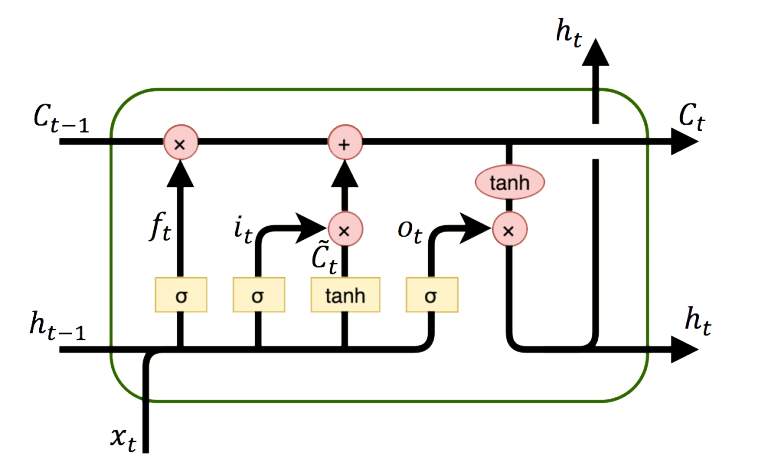

# Sentiment analysis NLP
The project on segmentation group of people who made possitive or negative comment. I cleared data for training neural networks model.
## Table of contents
- [Tech modules](#tech-modules)
- [Data set description](#data-set-description)
- [Structure neural networks](#structure-neural-networks)
- [Conclusion](#conclusion)
## Tech modules
- [tensorflow](https://www.tensorflow.org/)
- [nltk](https://www.nltk.org/)
- [Pandas](https://pandas.pydata.org/)
- [sklearn](https://scikit-learn.org/stable/)
- [Numpy](https://numpy.org/)
## Data set description
I took data set on [kaggle competition](https://www.kaggle.com/competitions/word2vec-nlp-tutorial/overview/description).
## Structure neural networks

    <h3 align="center">Long short-term memory</h3>

    

The compact forms of the equations for the forward pass of an LSTM cell with a forget gate are:

:<math>
\begin{align}
f_t &= \sigma_g(W_{f} x_t + U_{f} h_{t-1} + b_f) \\
i_t &= \sigma_g(W_{i} x_t + U_{i} h_{t-1} + b_i) \\
o_t &= \sigma_g(W_{o} x_t + U_{o} h_{t-1} + b_o) \\
\tilde{c}_t &= \sigma_c(W_{c} x_t + U_{c} h_{t-1} + b_c) \\
c_t &= f_t \circ c_{t-1} + i_t \circ \tilde{c}_t \\
h_t &= o_t \circ \sigma_h(c_t)
\end{align}
</math>

#### Variables
*<math>x_t \in \mathbb{R}^{d}</math>: input vector to the LSTM unit
*<math>f_t \in {(0,1)}^{h}</math>: forget gate's activation vector
*<math>i_t \in {(0,1)}^{h}</math>: input/update gate's activation vector
*<math>o_t \in {(0,1)}^{h}</math>: output gate's activation vector
*<math>h_t \in {(-1,1)}^{h}</math>: hidden state vector also known as output vector of the LSTM unit
*<math>\tilde{c}_t \in {(-1,1)}^{h}</math>: cell input activation vector
*<math>c_t \in \mathbb{R}^{h}</math>: cell state vector
*<math>W \in \mathbb{R}^{h \times d}</math>, <math>U \in \mathbb{R}^{h \times h} </math> and <math>b \in \mathbb{R}^{h}</math>: weight matrices and bias vector parameters which need to be learned during training

#### Activation functions
* <math>\sigma_g</math>: sigmoid function.
* <math>\sigma_c</math>: hyperbolic tangent function.
* <math>\sigma_h</math>: hyperbolic tangent function, or as the peephole LSTM paper suggests, <math>\sigma_h(x) = x</math>.

# Conclusion
On test data accuracy is 84.45%. Hypotheses of improving results: Increase train data set; Upgrade neural network; Work with lemmatization.
